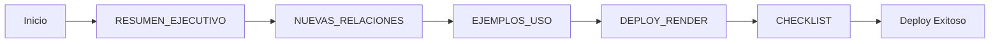

# 📚 Índice de Documentación - Relaciones Proveedores

## 🎯 ¿Qué documento necesitas?

### 🚀 Para Deployment Rápido

**Archivo:** [`DEPLOY_RENDER_RELACIONES.md`](./DEPLOY_RENDER_RELACIONES.md)  
**Tiempo de lectura:** 2 minutos  
**Contenido:**

- Pasos exactos para hacer deploy
- Qué hace Render automáticamente
- Verificación rápida post-deploy

**👉 Empieza aquí si solo quieres hacer el deploy YA.**

---

### ✅ Para Seguimiento Paso a Paso

**Archivo:** [`CHECKLIST_DEPLOYMENT.md`](./CHECKLIST_DEPLOYMENT.md)  
**Tiempo de lectura:** 5 minutos  
**Contenido:**

- Checklist completo pre-deployment
- Checklist de deployment
- Checklist de testing
- Troubleshooting detallado
- Métricas de éxito

**👉 Usa este si quieres asegurarte de no olvidar nada.**

---

### 📖 Para Entender los Cambios

**Archivo:** [`RESUMEN_EJECUTIVO_RELACIONES.md`](./RESUMEN_EJECUTIVO_RELACIONES.md)  
**Tiempo de lectura:** 10 minutos  
**Contenido:**

- Resumen completo de todos los cambios
- Qué se modificó en cada archivo
- Beneficios del cambio
- Flujos de trabajo
- Preguntas frecuentes

**👉 Lee este para entender QUÉ cambió y POR QUÉ.**

---

### 🔧 Para Detalles Técnicos

**Archivo:** [`NUEVAS_RELACIONES_PROVEEDORES.md`](./NUEVAS_RELACIONES_PROVEEDORES.md)  
**Tiempo de lectura:** 15 minutos  
**Contenido:**

- Detalles técnicos completos
- Schema de base de datos
- Código de API modificado
- Tipos TypeScript
- Migración SQL
- Troubleshooting avanzado

**👉 Consulta este si necesitas los detalles técnicos completos.**

---

### 💡 Para Aprender a Usar las Nuevas Funcionalidades

**Archivo:** [`EJEMPLOS_USO_RELACIONES.md`](./EJEMPLOS_USO_RELACIONES.md)  
**Tiempo de lectura:** 8 minutos  
**Contenido:**

- Ejemplos prácticos paso a paso
- Casos de uso reales
- Casos de error comunes
- Tips y buenas prácticas
- Comparativas visuales

**👉 Lee este si quieres ver ejemplos concretos de cómo funciona.**

---

## 🗺️ Guía de Navegación por Situación

### Situación 1: "Necesito hacer el deploy AHORA"

```
1. DEPLOY_RENDER_RELACIONES.md (2 min)
2. git push origin main
3. ✅ Listo
```

### Situación 2: "Quiero asegurarme de que todo salga bien"

```
1. DEPLOY_RENDER_RELACIONES.md (2 min)
2. CHECKLIST_DEPLOYMENT.md (5 min)
3. Seguir checklist paso a paso
4. ✅ Deployment verificado
```

### Situación 3: "¿Qué cambió exactamente?"

```
1. RESUMEN_EJECUTIVO_RELACIONES.md (10 min)
2. EJEMPLOS_USO_RELACIONES.md (8 min) [opcional]
3. ✅ Entendimiento completo
```

### Situación 4: "Necesito los detalles técnicos"

```
1. RESUMEN_EJECUTIVO_RELACIONES.md (overview)
2. NUEVAS_RELACIONES_PROVEEDORES.md (detalles)
3. Revisar código modificado
4. ✅ Conocimiento técnico completo
```

### Situación 5: "Algo salió mal en el deploy"

```
1. CHECKLIST_DEPLOYMENT.md → Sección Troubleshooting
2. NUEVAS_RELACIONES_PROVEEDORES.md → Sección Troubleshooting
3. Revisar logs de Render
4. Aplicar soluciones
5. ✅ Problema resuelto
```

### Situación 6: "¿Cómo uso las nuevas funcionalidades?"

```
1. EJEMPLOS_USO_RELACIONES.md (ejemplos prácticos)
2. Probar en desarrollo local
3. Probar en producción
4. ✅ Funcionalidades dominadas
```

---

## 📂 Estructura de Archivos

```
vendor-products-app/
├── DEPLOY_RENDER_RELACIONES.md          ← Guía rápida deploy
├── CHECKLIST_DEPLOYMENT.md              ← Checklist completo
├── RESUMEN_EJECUTIVO_RELACIONES.md      ← Overview de cambios
├── NUEVAS_RELACIONES_PROVEEDORES.md     ← Detalles técnicos
├── EJEMPLOS_USO_RELACIONES.md           ← Ejemplos prácticos
└── INDICE_RELACIONES.md                 ← Este archivo
```

---

## 🎯 Flujo Recomendado

### Para Desarrolladores:



### Para Product Owners:


### Para DevOps:


---

## 📊 Tabla de Contenidos por Documento

### DEPLOY_RENDER_RELACIONES.md

- ✅ Resumen de cambios
- ✅ Pasos para deploy
- ✅ Qué pasa con datos existentes
- ✅ Nuevas funcionalidades
- ✅ Soporte

### CHECKLIST_DEPLOYMENT.md

- ✅ Pre-deployment checklist
- ✅ Deployment paso a paso
- ✅ Post-deployment testing
- ✅ Troubleshooting detallado
- ✅ Métricas de éxito
- ✅ Checklist final

### RESUMEN_EJECUTIVO_RELACIONES.md

- ✅ Cambios completados
- ✅ Backend API
- ✅ Frontend UI
- ✅ Tipos TypeScript
- ✅ Flujos de trabajo
- ✅ Documentación creada
- ✅ Deployment en Render
- ✅ Verificación post-deploy
- ✅ Beneficios
- ✅ Funcionalidades nuevas
- ✅ Configuración Render
- ✅ Preguntas frecuentes

### NUEVAS_RELACIONES_PROVEEDORES.md

- ✅ Resumen de cambios
- ✅ Cambios implementados (detallado)
- ✅ Migración de base de datos
- ✅ Flujo de trabajo completo
- ✅ Deployment en Render (técnico)
- ✅ Verificación post-deploy
- ✅ Beneficios
- ✅ Notas importantes
- ✅ Comandos útiles
- ✅ Troubleshooting

### EJEMPLOS_USO_RELACIONES.md

- ✅ Caso 1: Crear compra válida
- ✅ Caso 1B: Compra inválida
- ✅ Caso 2: Venta con proveedor
- ✅ Caso 3: Venta sin proveedor
- ✅ Caso 4: Cambiar proveedor
- ✅ Caso 5: Filtrar ventas
- ✅ Casos de error comunes
- ✅ Caso 6: Métricas de proveedor
- ✅ Resumen de comportamientos
- ✅ Tips y buenas prácticas

---

## 🔍 Búsqueda Rápida

### ¿Necesitas información sobre...?

#### Deployment

- **¿Cómo hacer deploy?** → `DEPLOY_RENDER_RELACIONES.md`
- **Checklist completo** → `CHECKLIST_DEPLOYMENT.md`
- **Pasos detallados** → `CHECKLIST_DEPLOYMENT.md` → Paso 1-5
- **Troubleshooting** → `CHECKLIST_DEPLOYMENT.md` → Troubleshooting

#### Funcionalidades

- **¿Qué cambió?** → `RESUMEN_EJECUTIVO_RELACIONES.md`
- **¿Cómo funciona?** → `EJEMPLOS_USO_RELACIONES.md`
- **Detalles técnicos** → `NUEVAS_RELACIONES_PROVEEDORES.md`

#### Base de Datos

- **Migración** → `NUEVAS_RELACIONES_PROVEEDORES.md` → Migración
- **Schema** → `NUEVAS_RELACIONES_PROVEEDORES.md` → Schema
- **SQL** → Ver archivo en `prisma/migrations/20251018152108_add_vendor_to_sales/`

#### API

- **Cambios en API** → `RESUMEN_EJECUTIVO_RELACIONES.md` → Backend API
- **Validaciones** → `NUEVAS_RELACIONES_PROVEEDORES.md` → API Backend
- **Errores** → `EJEMPLOS_USO_RELACIONES.md` → Casos de Error

#### Frontend

- **Cambios en UI** → `RESUMEN_EJECUTIVO_RELACIONES.md` → Frontend UI
- **Ejemplos visuales** → `EJEMPLOS_USO_RELACIONES.md`
- **Selector de proveedor** → `NUEVAS_RELACIONES_PROVEEDORES.md` → Frontend UI

---

## ⏱️ Tiempos Estimados

| Documento         | Lectura | Ejecución | Total  |
| ----------------- | ------- | --------- | ------ |
| DEPLOY_RENDER     | 2 min   | 5 min     | 7 min  |
| CHECKLIST         | 5 min   | 20 min    | 25 min |
| RESUMEN_EJECUTIVO | 10 min  | N/A       | 10 min |
| NUEVAS_RELACIONES | 15 min  | N/A       | 15 min |
| EJEMPLOS_USO      | 8 min   | N/A       | 8 min  |

**Tiempo total para deploy verificado:** ~30 minutos  
**Tiempo total para entendimiento completo:** ~50 minutos

---

## 🎓 Niveles de Conocimiento

### Nivel 1: Básico (Deploy Rápido)

```
DEPLOY_RENDER_RELACIONES.md
│
└─> Suficiente para hacer deploy
    Tiempo: 7 minutos
```

### Nivel 2: Intermedio (Deploy Seguro)

```
DEPLOY_RENDER_RELACIONES.md
│
├─> CHECKLIST_DEPLOYMENT.md
│
└─> Deploy verificado sin errores
    Tiempo: 30 minutos
```

### Nivel 3: Avanzado (Entendimiento Completo)

```
RESUMEN_EJECUTIVO_RELACIONES.md
│
├─> EJEMPLOS_USO_RELACIONES.md
│
├─> DEPLOY_RENDER_RELACIONES.md
│
└─> CHECKLIST_DEPLOYMENT.md

    Tiempo: 45 minutos
```

### Nivel 4: Experto (Dominio Total)

```
RESUMEN_EJECUTIVO_RELACIONES.md
│
├─> NUEVAS_RELACIONES_PROVEEDORES.md
│
├─> EJEMPLOS_USO_RELACIONES.md
│
├─> Revisar código fuente
│
├─> DEPLOY_RENDER_RELACIONES.md
│
└─> CHECKLIST_DEPLOYMENT.md

    Tiempo: 90 minutos
```

---

## 🎯 Recomendaciones por Rol

### 👨‍💻 Desarrollador Backend

1. `RESUMEN_EJECUTIVO_RELACIONES.md` (overview)
2. `NUEVAS_RELACIONES_PROVEEDORES.md` (API details)
3. `EJEMPLOS_USO_RELACIONES.md` (casos de uso)
4. Revisar código de API

### 👨‍💻 Desarrollador Frontend

1. `RESUMEN_EJECUTIVO_RELACIONES.md` (overview)
2. `EJEMPLOS_USO_RELACIONES.md` (UI/UX)
3. `NUEVAS_RELACIONES_PROVEEDORES.md` → Frontend UI
4. Revisar código de `/sales/page.tsx`

### 👨‍💼 Product Owner

1. `RESUMEN_EJECUTIVO_RELACIONES.md` (beneficios)
2. `EJEMPLOS_USO_RELACIONES.md` (funcionalidades)
3. Preguntas frecuentes

### 🚀 DevOps

1. `DEPLOY_RENDER_RELACIONES.md` (deploy)
2. `CHECKLIST_DEPLOYMENT.md` (verificación)
3. `NUEVAS_RELACIONES_PROVEEDORES.md` → Comandos útiles

### 🧪 QA Tester

1. `EJEMPLOS_USO_RELACIONES.md` (casos de prueba)
2. `CHECKLIST_DEPLOYMENT.md` → Post-Deployment Testing
3. `NUEVAS_RELACIONES_PROVEEDORES.md` → Flujo de trabajo

---

## 📞 Soporte

### ¿No encuentras lo que buscas?

1. Usa Ctrl+F en este documento
2. Revisa la tabla de contenidos de cada documento
3. Consulta la sección de troubleshooting
4. Revisa los logs de Render

---

## 🔄 Actualizaciones de Documentación

**Última actualización:** 2025-10-18  
**Versión:** 1.0.0  
**Migración relacionada:** `20251018152108_add_vendor_to_sales`

---

**¡Feliz deployment! 🚀**
